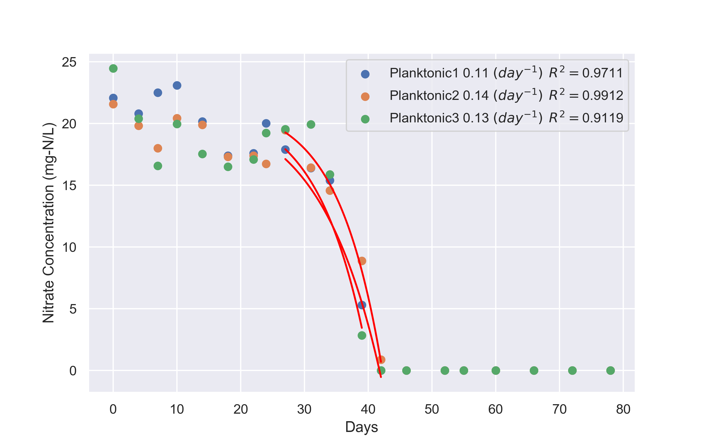
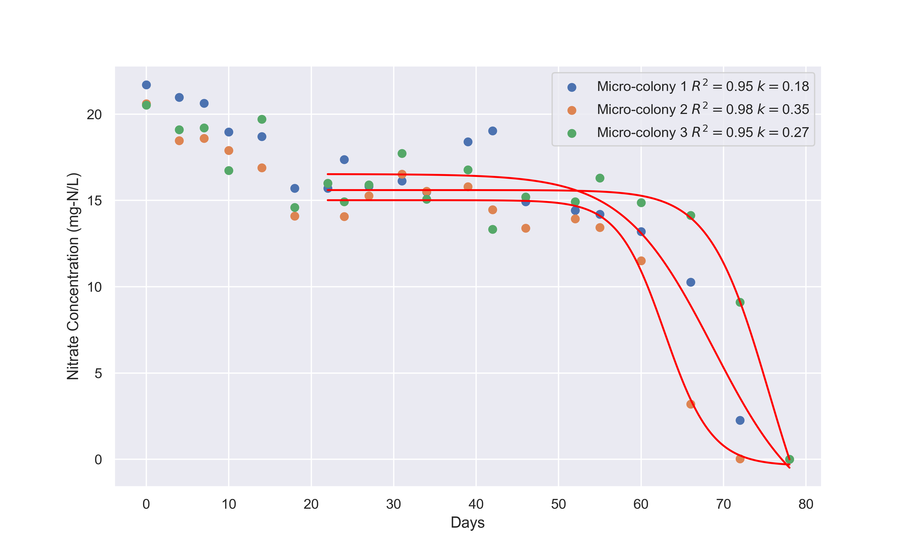
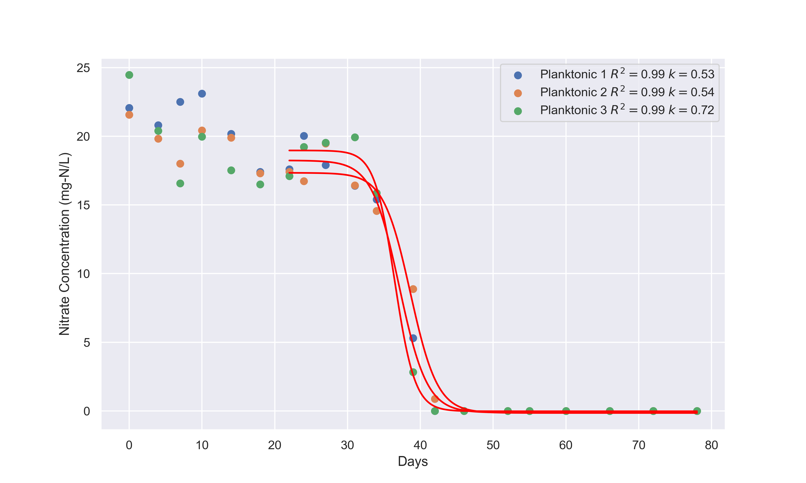

# 亜硝酸濃度フィッティング

## Microcolony 1,2,3のデータ

## Planktonic 1,2,3のデータ

## Microcolony 1,2,3 + Planktonic 1,2,3

# 増殖曲線に基づくフィッティング

増殖曲線の式を以下のように定義した。

$$f\hat{(t)}=ae^{\mu t}$$

亜硝酸消費量と菌体増加量の関係に線形性がある場合、亜硝酸消費曲線は以下のように表せる。

$$f_{n}\hat{(t)} = S_0 - kf\hat{(t)}$$

亜硝酸消費量と菌体増加量の関係が1:1であると仮定すると、

$$f_{n}\hat{(t)} = S_0 - f\hat{(t)}$$

($S_0$（mg-N/L) は初発亜硝酸濃度)

上式を用いてデータポイントをフィッティングした。

このとき、対数増殖期である範囲のみを選択した。

## 結果

$\mu \:(day^{-1})$ は以下基底関数内の$f\hat{(t)}$の部分についての値。

$$f_{n}\hat{(t)} = S_0 - f\hat{(t)}$$
### Microcolony

### Planktonic

上記の結果は対数増殖期において、亜硝酸消費量が菌体増加量と1:1の関係にあると仮定した場合の結果である。

個人的な感想：Planktonicの方が増殖曲線モデルの当て嵌まりが良くみえる。（液体培地だからかも？）
上記の比増殖速度を使用して単純に2つの系を比べるのは無理矢理過ぎるかもしれない。

# シグモイド関数に基づくフィッティング

フィッティングの基底関数を以下のように定義した。

$$y = \frac{L}{1 + e^{-(k(x-x_0))}} + b$$

上式を用いて、フィッティングを行った。

このとき、フィッティング範囲を求めるために、R2を最大化するようにフィッティング範囲のグリッドサーチを行った。

## 結果

### Micro colony

### Planktonic

